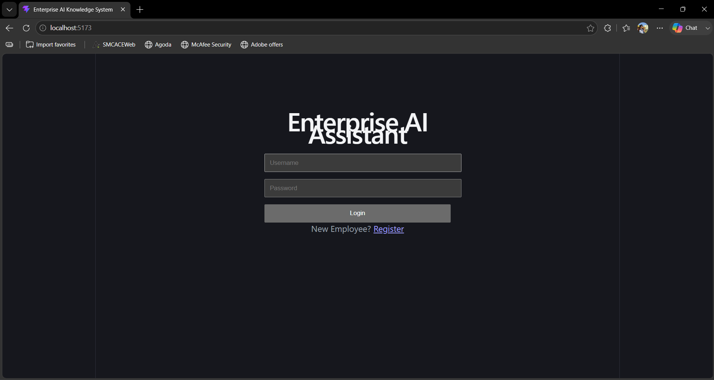
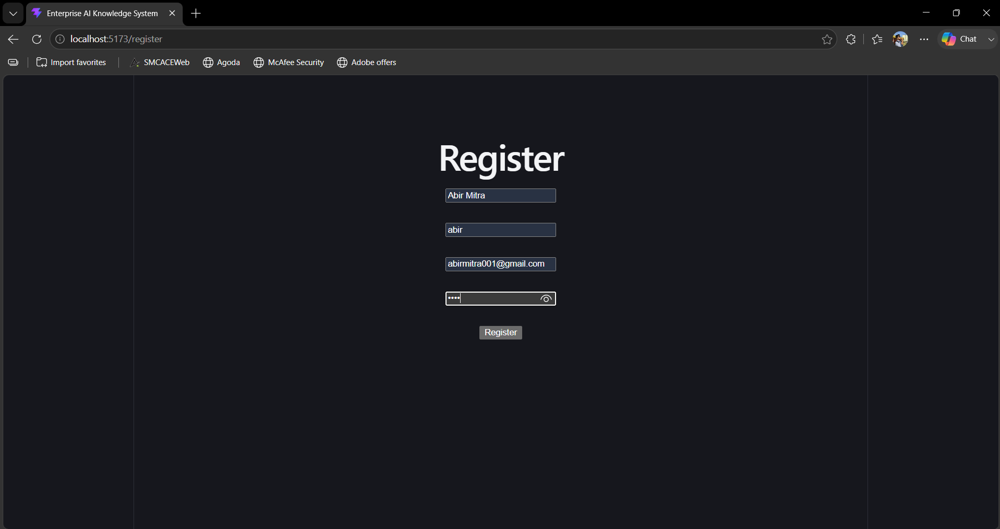
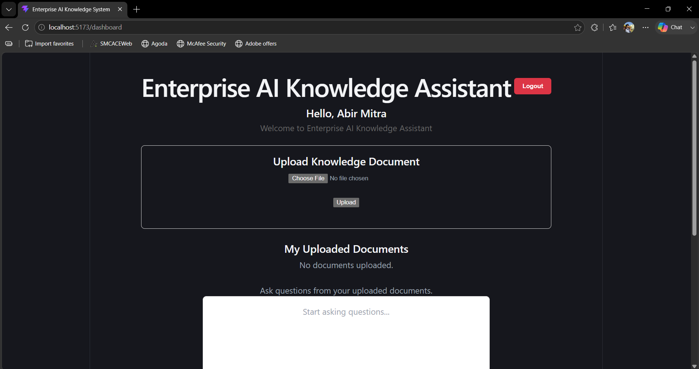
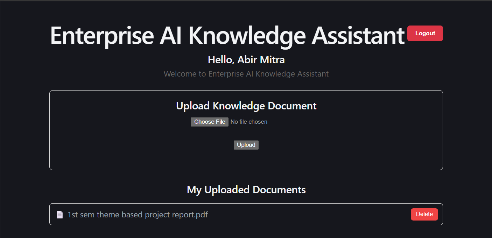
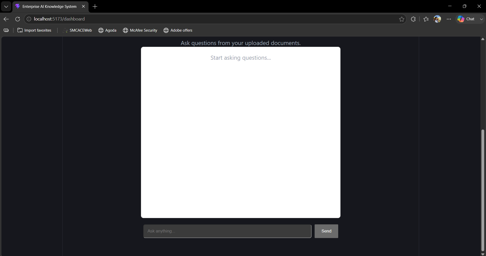
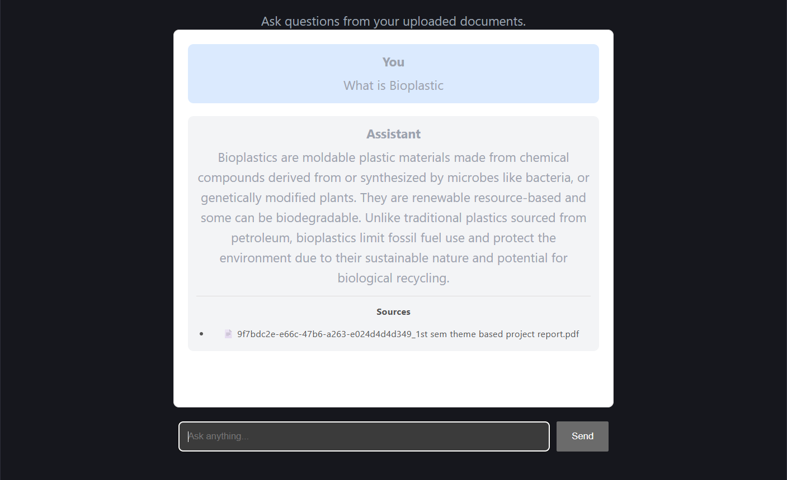

# Enterprise AI Knowledge System

An Enterprise Retrieval-Augmented Generation (RAG) platform that enables employees to securely upload organizational knowledge and interact with it through natural language conversations.

The system combines **FastAPI**, **React**, **PostgreSQL**, **ChromaDB**, **Sentence Transformers**, and **Ollama** to deliver accurate, context-aware answers from enterprise documents while maintaining user authentication and document management.

---

# 📌 Project Overview

Enterprise organizations generate thousands of documents such as:

- Technical Manuals
- Project Reports
- SOPs
- Policies
- User Guides
- Presentations
- Meeting Notes

Searching these manually is time-consuming.

The Enterprise AI Knowledge System converts uploaded documents into semantic embeddings and stores them in a vector database, allowing employees to ask questions in natural language and receive relevant answers instantly.

---

# ✨ Features

## Authentication

- User Registration
- Secure Login using JWT
- Password Hashing with BCrypt
- Session Management
- Logout

---

## Knowledge Management

- Upload PDF
- Upload DOCX
- Upload PPTX
- Upload TXT

Automatic

- Text Extraction
- Cleaning
- Chunking
- Embedding Generation
- Vector Storage

---

## AI Chat

- Natural Language Question Answering
- Retrieval-Augmented Generation (RAG)
- Semantic Search
- Context-based Responses
- Source Document Display
- Short and Concise Answers

---

## Document Management

Each employee can

- Upload Documents
- View Uploaded Documents
- Delete Uploaded Documents

Employees cannot view other users' uploaded files.

However,

All uploaded documents contribute to the enterprise knowledge base, allowing every employee to benefit from shared organizational knowledge.

---

# 🏗 System Architecture

```
                    Employee

                       │

                       ▼

                React Frontend

                       │

                REST API (FastAPI)

                       │

        ┌──────────────┴──────────────┐

        ▼                             ▼

 PostgreSQL                    Processing Service

(User Accounts)                      │

                                     ▼

                          Text Extraction

                                     │

                              Text Cleaning

                                     │

                                Chunking

                                     │

                         Sentence Transformer

                                     │

                               ChromaDB

                                     │

                             Similar Chunks

                                     │

                                 Ollama

                                     │

                               AI Response

                                     ▼

                           React Frontend
```

---

# ⚙ Technology Stack

## Frontend

- React
- Vite
- Axios
- React Router

---

## Backend

- FastAPI
- Python
- SQLAlchemy
- JWT Authentication
- BCrypt

---

## AI Stack

- Ollama
- Qwen2.5 3B
- Sentence Transformers
- ChromaDB
- Retrieval-Augmented Generation (RAG)

---

## Database

- PostgreSQL
- Chroma Vector Database

---

# 📂 Project Structure

```
Enterprise-AI-Knowledge-System

│

├── backend
│   ├── app
│   │
│   ├── api
│   ├── core
│   ├── databases
│   ├── embeddings
│   ├── models
│   ├── processors
│   ├── rag
│   ├── schemas
│   ├── services
│   ├── utils
│   └── vectorstore
│
├── frontend
│   ├── src
│   ├── assets
│   ├── components
│   └── pages
│
└── README.md
```

---

# 🔄 Workflow

1. Employee logs in.
2. Employee uploads a document.
3. Document is processed.
4. Text is cleaned.
5. Text is split into chunks.
6. Embeddings are generated.
7. Embeddings are stored in ChromaDB.
8. Employee asks a question.
9. Semantic search retrieves relevant chunks.
10. Ollama generates the final answer.
11. Answer and source documents are displayed.

---

# 🔐 Security

- JWT Authentication
- Password Hashing
- User-specific document management
- Secure API endpoints
- Protected Routes
- Authorization using Bearer Tokens

---

# 📷 Application Screenshots

## Login



---

## Registration



---

## Dashboard



---

## Upload Documents



---

## AI Chat





# 📡 API Endpoints

## Authentication

```
POST /auth/register

POST /auth/login
```

---

## Documents

```
POST /documents/upload

GET /documents/my

DELETE /documents/{id}
```

---

## Chat

```
POST /chat
```

---

# 🚀 Installation

## Clone Repository

```bash
git clone https://github.com/abirmitra01/Enterprise-AI-Knowledge-System.git
```

---

## Backend

```bash
cd backend

python -m venv venv

venv\Scripts\activate

pip install -r requirements

uvicorn app.main:app --reload
```

---

## Frontend

```bash
cd frontend

npm install

npm run dev
```

---

## Required Services

- PostgreSQL
- Ollama
- ChromaDB (auto-created)

---

# 💡 Future Improvements

- Docker Support
- MongoDB Integration
- Redis Response Cache
- Streaming AI Responses
- Role-Based Access Control
- Admin Dashboard
- Multi-language Support
- Document Versioning
- OCR Support
- Image Search
- Voice Assistant
- Team Workspaces
- Citation Highlighting
- Cloud Deployment
- Kubernetes Support

---

# 🎯 Learning Outcomes

This project demonstrates practical implementation of

- FastAPI Backend Development
- React Frontend Development
- REST API Design
- JWT Authentication
- PostgreSQL Integration
- Vector Databases
- Semantic Search
- Retrieval-Augmented Generation (RAG)
- Large Language Models
- Enterprise AI Architecture

---

# 👨‍💻 Authors

**Abir Mitra**

B.Tech Electronics & Communication Engineering

AI | Machine Learning | Generative AI | Full Stack Development | Python

Email:
abirmitra001@gmail.com

LinkedIn:
https://linkedin.com/in/abir-mitra-7b4a98253

---

# ⭐ Support

If you found this project useful, consider giving it a ⭐ on GitHub.

---

# 📜 License

This project is intended for educational and portfolio purposes.